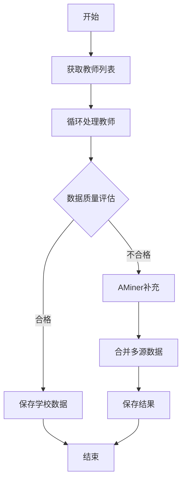

## 🔍 项目简介
这是一个利用AI爬虫自动化爬取和整合高校教师信息的工具，使用了[Scrapegraphai](https://github.com/ScrapeGraphAI/Scrapegraph-ai)这个智能爬虫库（需要自行配置LLM的API），能批量爬取学校教师门户网页的教师信息，输出结构化的json数据，便于查看和分析。在学校官网信息不足时，还可以在[AMiner](https://aminer.cn/)平台（清华博士团队开发的信息挖掘的学术平台，信息质量很高）搜索补充数据，融合原有数据输出。对选课、了解导师方向，或者通过后续分析了解学校教师队伍结构很有帮助！

## 🤔 我为什么要做这个小项目？

在浏览导师信息的时候，我发现一个个点进详情页查看教师信息太费时间了，而且我还想统计一下教师队伍的年龄层次和研究领域分布，所以就想着能不能一次性把所有信息爬下来，做成结构化数据方便查看和分析。

一开始我尝试用传统爬虫，但很快就遇到一个问题：每位老师的个人网页结构和内容格式都不一样，传统爬虫的CSS选择器和正则表达式写了一大堆效果还是很差，而且这还没考虑后续麻烦的**数据清洗**呢！正好这时突然看到了[Scrapegraphai](https://github.com/ScrapeGraphAI/Scrapegraph-ai)这个AI爬虫库（24年发布的一个比较火的开源项目），刚好解决了我的问题。

但很快我又遇到第二个问题：很多老师在学校官网上的信息很少（尤其是南大大气院的教师网页），我只好尝试借助外部数据源补充信息，然而知网这方面做得很一般，老师们也不太可能都有百科词条，不过世上无难事，只怕有心人，我最终还是找到了[AMiner](https://aminer.cn/)这个宝藏网站，上面的学术信息非常丰富（推荐教师详情信息去这上面参考），可以很好地作为补充数据源。

技术路线完善了，只欠东风，我就以南信大大气院的教师门户为例，开发了这个程序（断断续续花了一个多月）。其中只有教师列表页用到了传统爬虫（BeautifulSoup和requests），具体的教师详情页全都用AI爬虫处理。这里还要感谢[Deepseek](https://platform.deepseek.com/usage)提供了高性价比的API（其实有API白嫖方案，但我想保证输出数据的质量），方便我测试开发（要是用GPT或Claude的API，我估计要破产了💸，自然也不会尝试推进这个项目了）。

正因为使用了AI爬虫，这个项目有很好的可扩展性，只要改一下school_get_links.py里的传统爬虫代码，就能适配其他学院甚至其他学校了。我下一步打算做南大大气院的详情页url获取，同时开发一些统计分析功能，算是小修小补了。

## 📁 项目结构

```
Teacher-Analysis/
├── main.py                # 主程序入口
├── scrapers/              # 爬虫模块
│   ├── shool_get_links.py # 学校教师列表爬虫
│   ├── smart_scraper.py   # 智能爬虫（基于LLM的通用爬虫）
│   └── aminer_search.py   # AMiner搜索和爬取模块
├── utils/                 # 工具模块
│   ├── check_data_quality.py # 数据质量检查
│   └── merge_data.py         # 数据合并工具
├── config/                # 配置文件目录
│   ├── aminer_cookies.json   # AMiner网站的cookies
│   └── org_mapping.json      # 机构名称映射配置
└── NUIST_teacher_data/    # 输出数据目录
```

## ⚙️ 系统工作流程



基本流程很简单：
**先爬学校网站→检查数据质量→不够完整的就去AMiner补充→合并数据→保存结果**
整个过程全自动化，只需要看看日志输出就知道进度了。

## 🛠️ 所需依赖

- **scrapegraphai**：大模型驱动的智能爬虫库，能根据提示词自动理解网页结构，爬取内容
- **bs4 & requests**：传统爬虫两件套，用于解析静态网页
- **playwright**：浏览器自动化工具，AI爬虫的依赖，同时也用于AMiner的登录和搜索（取代selenium）

## 🚀 使用方法

1. **配置LLM的API** ✨

   在`scrapers/smart_scraper.py`中找到`graph_config`，添加你的API密钥：
   ```python
   graph_config = {
       "llm": {
           "model": "deepseek/deepseek-chat", # 这里使用的是deepseek官网的API，也可以换成其他API
           "api_key": "你的API密钥",  # 修改为你的密钥
       },
       # 其他配置不变
   }
   ```

2. **配置AMiner的cookies** 🍪

   AMiner平台需要登录才能查看完整教师信息。首次运行时，系统会打开浏览器让你登录AMiner，登录后会自动保存cookies，后续运行就不需要再次登录了。可以运行一下aminer_search.py的测试代码，初始化一下cookies。

3. **配置学校名称映射** 🏫

   编辑`config/org_mapping.json`，设置学校在AMiner上可能的名称形式，以正确匹配搜索对应组织的教师：
   ```json
   {
       "南京信息工程大学": ["南京信息工程大学", "nuist", "Nanjing University of Information Science & Technology", "南信大"]
   }
   ```

4. **运行程序** ▶️

   直接运行main.py即可，默认是测试模式，只处理3位教师的数据，如需爬取全部教师信息，可以在`main.py`中修改`test_limit = 3`为`test_limit = 0`。
   
   你还可以设置以下选项：
   ```python
   # 在main.py中设置
   test_limit = 3       # 测试模式下爬取的教师数量（设为0则爬取全部数据）
   force_aminer = False # 是否强制使用AMiner搜索
   headless = False     # 是否使用无头模式（设为True可隐藏浏览器界面）
   ```

## 📊 数据格式

系统会在`NUIST_teacher_data/`目录下为每位教师生成一个JSON文件，数据格式如下（源格式是由提示词决定的，可以在smart_scraper.py的scrape_prompt中查看和修改）：

**以我们的陈海山校长为例**
```json
{
    "basic_info": {
        "name": "陈海山",
        "title": ["教授"],
        "mentor_qualification": ["博导"],
        "honors": ["国家杰出青年基金获得者"]
    },
    "bio_details": {
        "birth_year": "1985",
        "education": {
            "undergrad": "2003-2007 南京大学 大气科学",
            "master": "2007-2010 北京大学 气象学",
            "phd": "2010-2015 清华大学 环境科学"
        }
    },
    "work_experience": [
        {
            "period": "2015-2020",
            "institution": "南京大学",
            "position": "副教授"
        },
        {
            "period": "2020-至今",
            "institution": "南京信息工程大学",
            "position": "教授"
        }
    ],
    "academic": {
        "research_fields": ["大气物理", "气候变化"],
        "publications": [
            {
                "title_cn": "某某研究",
                "journal": "某某期刊",
                "year": 2020
            }
        ]
    }
}
```

这个结构化数据可以直接用Python的json库读取，然后就能做各种分析了。

## 💡 小贴士

- 如果AMiner搜索失败，可以试试手动登录更新cookies
- 爬取过程中看到日志有WARNING不用担心，是正常的数据质量提示
- 已经爬取过的教师不会重复爬取，除非你删除对应的JSON文件

希望这个工具能帮助到有需要的同学们！如有问题或建议，欢迎交流。👋

