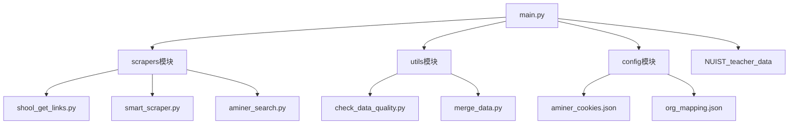
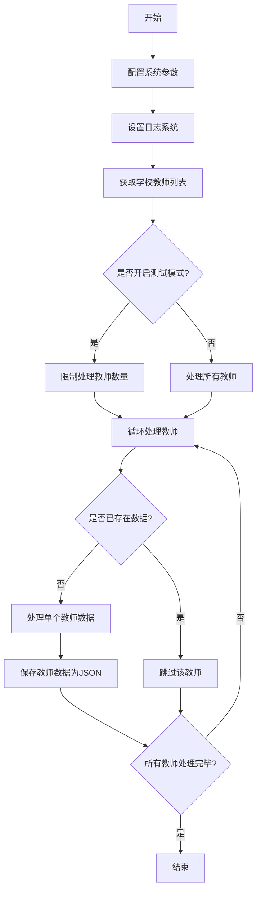
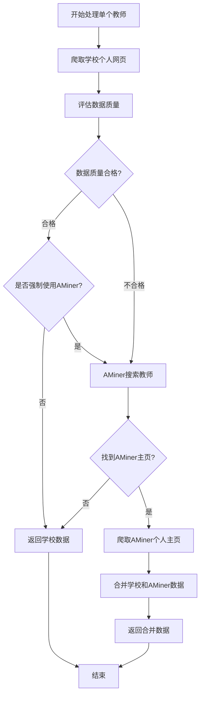
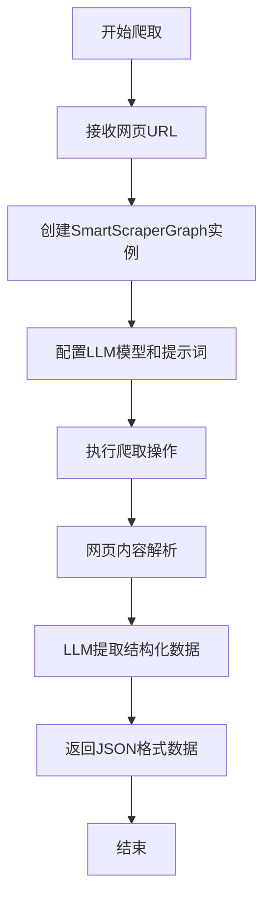
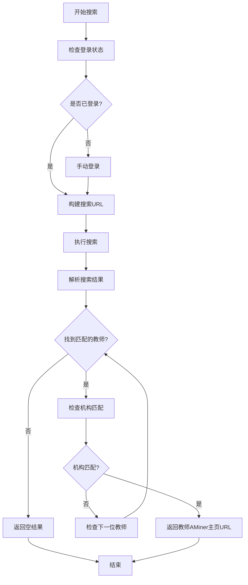
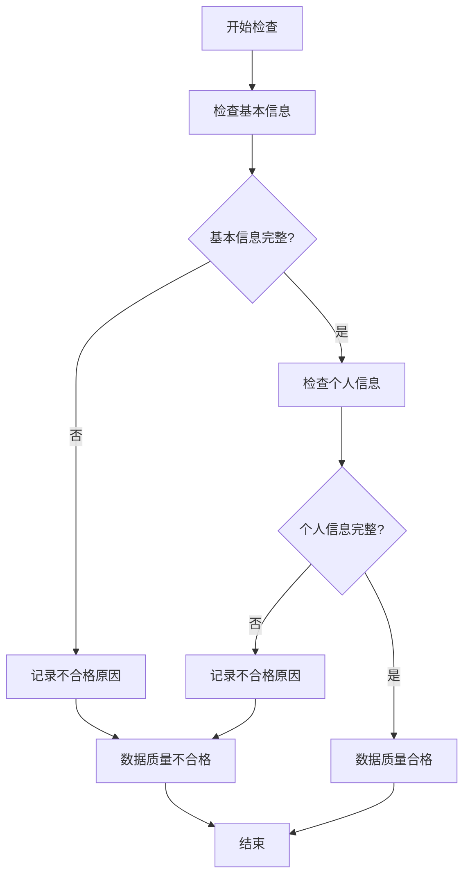
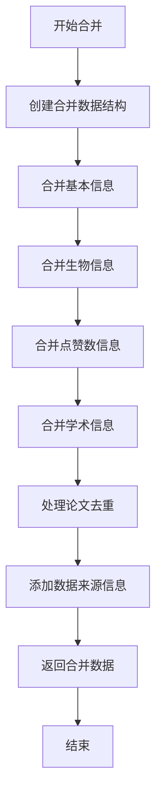
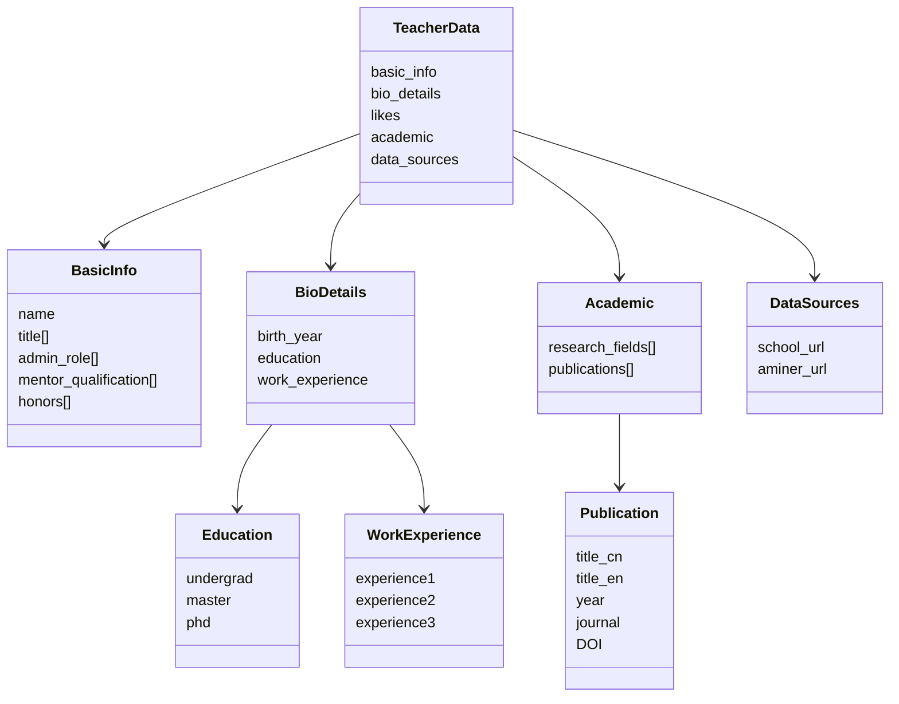

# 教师信息爬取系统技术架构说明

## 1. 项目概述

教师信息爬取系统是一个用于采集、整合高校教师信息的Python应用程序。系统通过爬取学校官方网站和学术平台（AMiner）获取教师的基本信息、教育背景、研究方向和学术成果等数据，并进行数据合并、质量评估和结构化存储。为后续的分析提供高度结构化的优质json数据。

## 2. 系统架构

系统采用模块化设计，主要分为以下几个部分：

```
Teacher-Analysis/
├── main.py                # 主程序入口
├── scrapers/              # 爬虫模块
│   ├── shool_get_links.py # 学校教师列表爬虫
│   ├── smart_scraper.py   # 智能爬虫（基于LLM的通用爬虫）
│   └── aminer_search.py   # AMiner搜索和爬取模块
├── utils/                 # 工具模块
│   ├── check_data_quality.py # 数据质量检查
│   └── merge_data.py         # 数据合并工具
├── config/                # 配置文件目录
│   ├── aminer_cookies.json   # AMiner网站的cookies
│   └── org_mapping.json      # 机构名称映射配置
└── NUIST_teacher_data/    # 输出数据目录
```

### 系统组件关系图



## 3. 模块功能详解

### 3.1 主程序模块 (main.py)

主程序模块是系统的入口点，负责整个数据处理流程的协调和控制。主要功能包括：

- **日志系统配置**：设置日志格式和输出方式
- **单个教师处理流程**：封装了处理单个教师信息的完整流程
- **批量教师处理流程**：管理多个教师数据的批量处理
- **测试模式支持**：支持测试模式，只处理少量教师数据进行验证

#### 系统整体工作流程图



#### 单个教师处理流程图



### 3.2 爬虫模块 (scrapers/)

#### 3.2.1 学校教师列表爬虫 (shool_get_links.py)

负责从学校官方网站获取所有教师的基本信息和个人主页链接。

- **SchoolScraper类**：根据学校名称选择爬取策略
- 当前支持南京信息工程大学教师列表爬取
- 返回包含教师姓名和URL的列表

#### 3.2.2 智能爬虫 (smart_scraper.py)

基于大型语言模型的通用网页内容抽取工具，能够从不同格式的教师主页提取结构化数据。

- 使用ScrapegraphAI库实现智能网页内容抽取
- 支持从各种结构的教师主页提取统一格式的数据
- 自定义提示词指导模型如何抽取特定字段

#### 智能爬虫工作流程



#### 3.2.3 AMiner搜索模块 (aminer_search.py)

负责在AMiner学术平台搜索教师信息并获取其个人主页URL。

- **LoginManager类**：处理AMiner网站的登录状态管理
- 支持机构名称映射，提高搜索精度
- 使用Playwright实现浏览器自动化，处理动态加载内容

#### AMiner搜索流程



### 3.3 工具模块 (utils/)

#### 3.3.1 数据质量检查 (check_data_quality.py)

负责评估爬取的教师数据是否完整和准确。

- 检查基本信息字段（姓名、职称、导师资格等）
- 检查个人信息字段（出生年份、教育经历等）
- 返回数据质量评估结果和不合格原因

#### 数据质量检查流程



#### 3.3.2 数据合并工具 (merge_data.py)

负责合并从不同来源（学校网站和AMiner）获取的教师数据。

- 分别合并基本信息、生平信息、学术信息等不同类别数据
- 处理数据冲突，采用优先级策略（例如某些字段优先使用学校数据）
- 对重复数据（如论文）进行去重处理

#### 数据合并流程



### 3.4 配置模块 (config/)

- **aminer_cookies.json**：存储AMiner网站的登录凭证
- **org_mapping.json**：存储机构名称映射，用于提高AMiner搜索准确性

## 4. 数据结构

系统处理和存储的教师数据采用JSON格式，主要包含以下结构：

```json
{
    "basic_info": {
        "name": "教师姓名",
        "title": ["职称列表"],
        "admin_role": ["行政职务"],
        "mentor_qualification": ["导师资格"],
        "honors": ["荣誉头衔"]
    },
    "bio_details": {
        "birth_year": "出生年份",
        "education": {
            "undergrad": "本科教育经历",
            "master": "硕士教育经历",
            "phd": "博士教育经历"
        },
        "work_experience": {
            "experience1": "工作经历1",
            "experience2": "工作经历2"
        }
    },
    "likes": "点赞数",
    "academic": {
        "research_fields": ["研究领域1", "研究领域2"],
        "publications": [
            {
                "title_cn": "论文中文标题",
                "title_en": "论文英文标题",
                "year": "发表年份",
                "journal": "期刊名称",
                "DOI": "DOI号"
            }
        ]
    },
    "data_sources": {
        "school_url": "学校数据源URL",
        "aminer_url": "AMiner数据源URL"
    }
}
```

### 数据结构关系图



## 5. 技术特点

1. **多源数据采集**：集成学校官网和AMiner平台的数据，提高数据完整性
2. **智能内容抽取**：使用大语言模型进行智能内容抽取，适应不同网页结构
3. **模块化设计**：系统各组件高度模块化，易于扩展和维护
4. **数据质量评估**：内置数据质量评估机制，确保数据完整性
5. **灵活配置**：支持测试模式、强制使用AMiner等配置项

## 6. 扩展性

系统设计具有良好的扩展性，可以通过以下方式进行扩展：

1. 添加新的学校爬虫：在SchoolScraper类中增加新学校的处理逻辑
2. 集成更多学术平台：参考AMiner模块，添加其他学术平台的搜索和数据采集
3. 增强数据分析功能：基于已采集的结构化数据，开发教师学术影响力分析等功能

## 7. 使用方法

系统使用非常简单，只需运行主程序：

```python
python main.py
```

可以通过修改main.py中的以下参数调整系统行为：
- test_mode：是否启用测试模式
- test_limit：测试模式下处理的教师数量
- force_aminer：是否强制使用AMiner数据